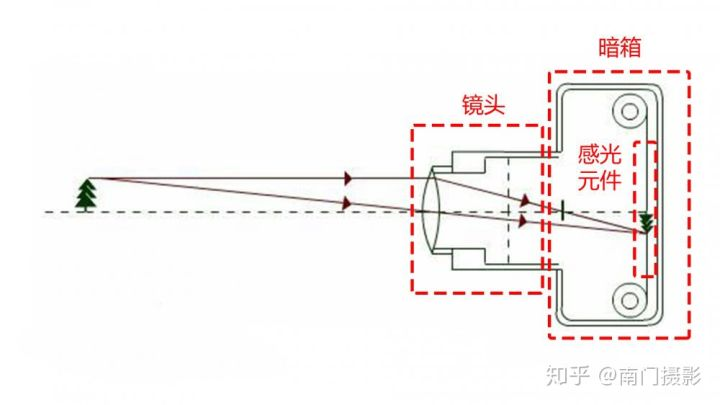
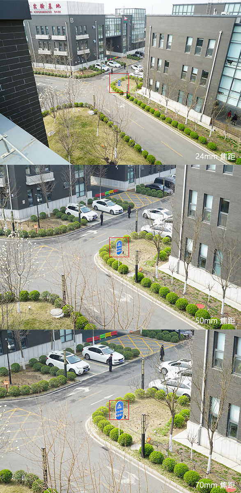
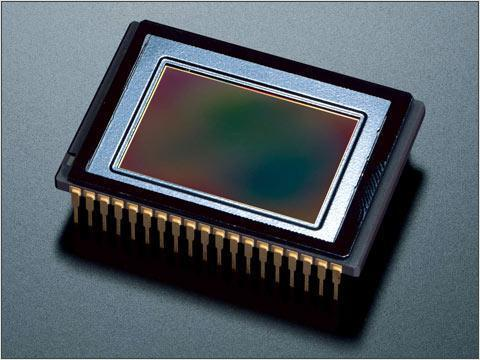
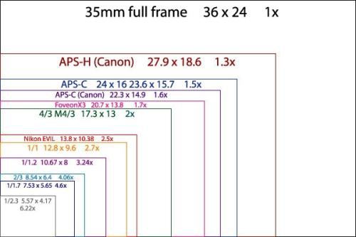
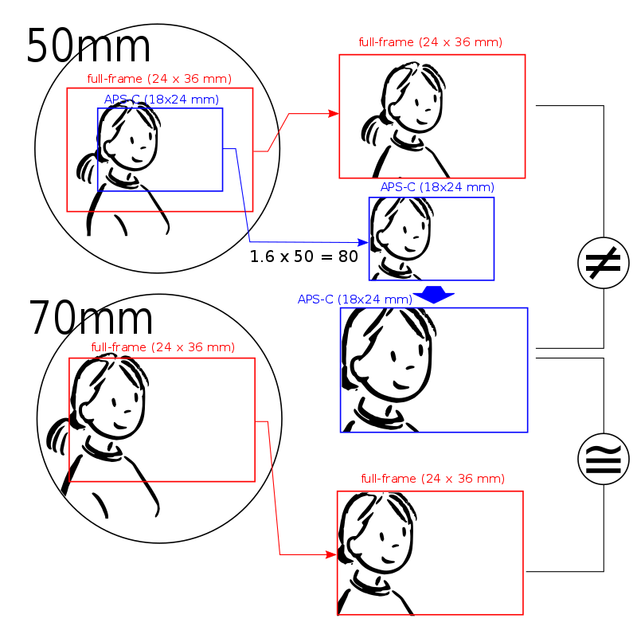
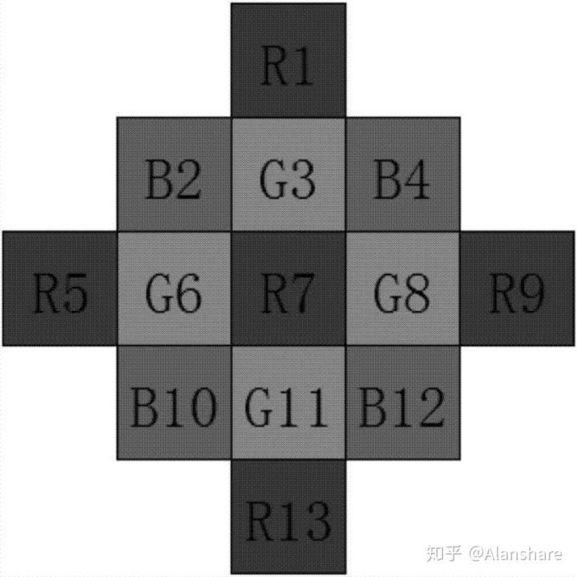
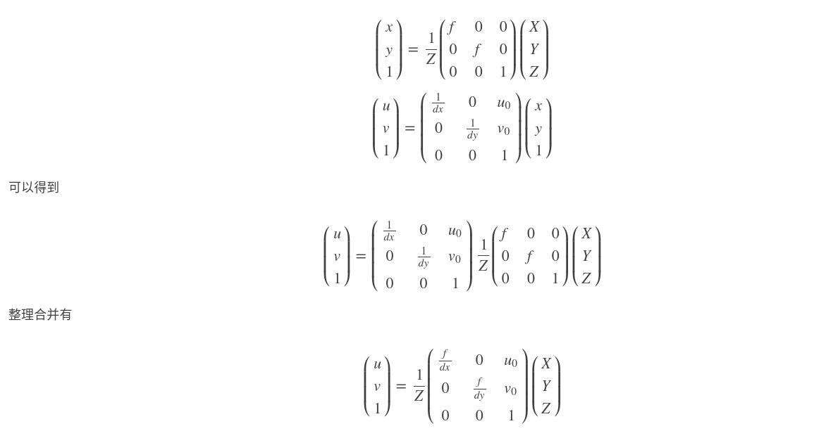

# 相机焦距知多少

本文主要有由以下两个部分的内容组成：

* 等效焦距
* 相机成像模型的计算

## 等效焦距引出

想了解等效焦距的概念，首先要引出以下内容：

* 相机的成像过程

* 相机镜头的物理焦距
* 相机的底

### 相机的成像过程

* 光线通过**镜头**进入相机，被**感光的底**（现在常见的基本都是**CMOS**）采集

* 相机的底进行滤色、感光（光电转化）并按照一定的排列方式将拍摄物体“分解”成了一个一个的**像素点**

* 像素点以模拟图像信号的形式转移到“**模数转换器**”上，转换成数字信号，传送到**图像处理器**上，处理成真正的图像

  

  
  

### 物理焦距

物理焦距，代表镜头的屈光能力，**焦距越短，成像就离镜头越近**，也就是屈光越狠，不过这是薄透镜的概念，当镜片不止一片时这个规律就不一定起效果了。物理焦距会影响**视野角度**，物理焦距长的镜头提供较小的视角，但远处的景物会得到放大。短物焦镜头中的景物都显得很小，但可以提供很大的视角，让你拍到大角度场景，或者拍出有张力的图片来。通常来说物理焦距越长，镜头通常也会越长。

如上图所示，直观上，24mm焦距拍摄的照片视角广阔，50mm焦距拍摄的照片视角更接近人眼所见，而70mm焦距拍摄的照片有种被拉近放大的感觉。

### 相机的底片

**感光底**负责将图像采集。目前主流的底都是**CMOS**，所以下文以**CMOS**代称感光底。底有大有小，其计算方式因为一些历史遗留问题而比较特殊。

#### 全画幅

**全画幅**（或称**全片幅**，**135全画幅**，英语：Full Frame，德语：Kleinbild Film）是一个摄影方面的术语，指的是感光面积为**36mm×24 mm**尺寸大小的规格。这一规格被用于描述镜头的成像圈指标和感光元件的尺寸。

#### 1英寸CMOS的大小——对角线长16mm

`1英寸CMOS的对角线长度为16mm，而不是25.4mm。`

这大概要追溯到二十世纪**五、六十年代**电子成像技术刚开始的时代吧。那时早期的电视摄像机使用的感光元件是**真空管**（现在常见的CCD和CMOS传感器）。真空管的外面是有个玻璃罩子的，真空管外径是把玻璃厚度也算进去的，玻璃管当然是不能用于成像的，外径1英寸的真空管，实际成像区域只有**16mm**左右，于是**16mm**就成了电子摄像照相行业一个约定俗成的度量单位。现在虽然真空管成像技术现在已经不使用了，但是这种度量方式却被一直继承了下来。所以现在数码成像元件中提到英寸这个单位，都不能按**工业标准**的**1英寸=25.4mm**来计算，而要按**1英寸=16mm**来计算，即感光元件为**12.8mm×9.6mm**时，它是1英寸感光元件。这种标示方法多用于长宽比为**4∶3**的袖珍数码相机和消费级数码相机上。

#### CMOS大小对成像的影响

直观地来说，**CMOS**的大小会影响成像的**视角**

如上图所示，50mm镜头成像要比物理焦距更长的70mm镜头更小景物更靠中心。**更大的全画幅总是能够在同镜头内采集更大的视角**。而长宽只有前者2/3的APS-C画幅只有其长宽2/3的视野。要想获得接近的照片角度，只能使用焦距更短的镜头。这里使用50mm镜头的APS-C所获得的视角就较为接近70mm全画幅，要想理论上一致，则需要使用70*2/3=46.666....mm的镜头。没错就是直接乘两个CMOS的长度比例计算。

为了保证不同CMOS的相机（**不同长度物理焦距与不同大小的底的组合**）拍照时**视角**的一致性，于是要引入一个概念，**等效焦距**。

## 等效焦距

### 定义

在摄影中，**35mm等效焦距**用于表示特定的照相机与底片或图像感光元件]所组合得到的视角。由于大部分摄影师都使用接环镜头以及 **35mm**底片格式很熟悉，因此这一术语对于他们很有帮助。

在使用**35 mm底片**的相机上，28 mm镜头是**广角镜头**，而200 mm镜头是**长焦镜头**。然而现在数码相机已几乎完全取代了35mm底片相机，**焦距与视角之间不再有统一的关联**。因为相机的感光元件尺寸也会影响视角，而感光元件的尺寸已不再像底片时代那样唯一。对于特定的镜头与感光元件的组合，它的35mm等效焦距意思是说，**在35mm底片相机上，这一焦距可以得到同样的视角**。

通常，等效焦距是基于视角的**对角线**。而有时它可能基于视角的**水平线**。由于35 mm底片的长宽比是3:2，而很多数码相机的感光元件长宽比是4:3，所以这两种定义并不完全相等。

### 计算

根据比例关系计算：

`等效焦距/镜头实际焦距 = 135胶片对角线长度/CMOS对角线长度`

其中135胶片的尺寸为36mm×24 mm，对角线长度**43.27mm**，按一英寸16mm计算是**2.70英寸**长度

### 传感器参数

**有效像素**、**传感器尺寸**和**（等效）单位像素尺寸**是手机相机传感器的核心参数。

#### 有效像素

有效像素是真正参与**感光成像**的像素值，有效像素越大，解析度越高，照片细节更清晰。

#### 最大像素

是经过插值运算后获得的最大的图片像素。

#### 像素插值

插值像素并不是数码相机本身的有效像素，它的取值只是在摄像时用软件优化处理后所提升的像素值，数码相机内部的DSP芯片根据中心像素点的颜色参数，模拟出周边像素值的方法，是数码相机特有的放大数码照片的软件手段。

#### 传感器尺寸

传感器大小决定了有多少光被捕捉。拍照时，传感器上每一个像素都纪录“光信息”，传感器尺寸大意味着更丰富的信息。这也就意味着“大底”传感器能带来更高的动态范围、更广的ISO范围和更少的噪点。直接表现就是明暗条件复杂场景下更好的曝光和细节还原，以及暗光环境下更好的曝光和噪点控制。

#### 单位像素尺寸

单位像素尺大小决定了传感器的**感光能力**，越大意味着更好的**暗光拍摄能力**，最直观的表现是噪点水平。单位像素尺寸和传感器宽度以及照片分辨率的关系如下：

<b>单位像素尺寸＝传感器宽度／照片分辨率宽度</b>

从公式可看出，有效像素、传感器尺寸和单位像素尺寸是互相影响的。如果一个传感器的单位像素尺寸大，那一般情况下它的传感器尺寸就不会小。但有些传感器像素太高，这时传感器体积再大也避免不了单位像素尺寸的渺小。这时就会用到素四合一，**用四个小像素合成一个大像素**，把像素数量降到原来的四分之一。尽量用够大的等效单位像素尺寸来弥补小像素感光能力不足的劣势。

### 计算实例

小米8的主摄像头型号索尼IMX363，相机的物理焦距为4.22mm，有效像素4032 x 3024，单个像素的大小为1.4μm，传感器尺寸(对角线)长为7.06mm(1/2.55")，长宽为(5.64mm × 4.23mm)。

这里存在一个问题：维基百科中给出的传感器尺寸(对角线)长为7.06mm(1/2.55")，但是按照1英存=16mm的换算关系，7.06mm应该等于1/2.26"，与括号中的1/2.55"不符。

由于以下公式成立

**单位像素尺寸(1.4μm)＝传感器宽度(5.64mm × 4.23mm)／照片分辨率宽度(4032 x 3024)**

且7.06^2 = 5.64^2 +  4.23^2

所以在计算等效焦距时取传感器的对角线长度为7.06mm，代入等效焦距的计算公式：

等效焦距/4.22 = 43.27/7.06

得到小米8的主摄像头的等效焦距为25.86

### 等效焦距与视角的对应关系

---

## 小孔成像模型的具体计算

本文对小孔成像模型的推导过程不做过多解读，详细的推导过程可参考[这个博客](http://zhaoxuhui.top/blog/2018/04/17/CameraCalibration.html)。下文主要讲一下小孔成像模型中用到的参数的具体含义，并举例说明。

### 相机投影模型

参考博客中的推导过程如下:

其中`(X, Y, Z)`为3D点`P`在相机坐标系下的坐标，` (x, y, z)`为`P`在成像平面坐标系下的坐标，(`u, v)`为`P`在像素平面坐标系下的坐标，以下为几个重要参数说明：

* ，`，这f`为相机的**物理焦距**，单位为**mm**

* `dx`和`dy`为单个像素在水平方向和竖直方向的长度(一般情况下相等，但是也有一些相机的不同），单位为**mm/pixel**上的归一化焦距

* `fx = f/dx`, `fy = f/dy`。分别称为x轴和y轴的**归一化焦距**，单位为**pixel**

* `u0，v0`表示图像的中心像素坐标和图像原点像素坐标之间相差的横向和纵向像素数，单位为**pixel**

### 计算实例

这部分内容研究了很久，但是依然没有透彻地理解，对于下面的问题，有以下疑问：

* 当相机的长宽比从4：3切换为16：9时，每个像素的大小到底发生了怎样的变化，如果单纯地理解为像素在水平方向和竖直方向等比例合并（合并的比例以水平方向为准），那么为什么分辨率为**4032 x 3024**和**4032 x 2268**两种情况下的`fx`相差了30多个像素，是因为标定的**误差**还是原理上的理解**错误**？这一点暂时没有想明白，暂时按照误差理解。

仍然以小米8的主摄为例子，相机的物理焦距为4.22mm，有效像素4032 x 3024，单个像素的大小为1.4μm，传感器尺寸(对角线)长为7.06mm(1/2.55")，长宽为(5.64mm × 4.23mm)，根据上文的相机投影模型计算理想情况下的`fx`与`fy`：

* 当图像的分辨率为**4032 x 3024**（4：3的长宽比）理想情况下，

  由于单个像素的边长是1.4μm，所以

  `dx0 = dy0 = 1.4(μm/pixel)`

  `fx = fy = f/dx0 = f/dy0 = 4.22mm/1.4(μm/pixel) = 3014 pixel`

  `u0 = 4032/2= 2016`

  `v0 = 3024/2 = 1512`  

  使用matlab进行标定的结果为:` fx = 3093.8, fy = 3080.4, cx = 2005, cy = 1480.6`

  畸变系数 `k1 = 0.2168, k2 = -0.7039`

* 当图像的分辨率为**4032 x 2268**（16：9的长宽比）时，与**4032 x 3024**的分辨率类似，

  `fx = fy = f/dx0 = f/dy0 = 4.22mm/1.4(μm/pixel) = 3014 pixel`

  `u0 = 4032/2= 2016`

  `v0 = 2268/2 = 1134`  

  使用matlab进行标定的结果为:` fx = 3130.2, fy = 3114.5, cx = 2035.6 cy = 1095.9`

  畸变系数`k1 = 0.2581, k2 = -0.9181`

* 当图像的分辨率为**640 x 480**（4：3的长宽比）时（原图分辨率为**4032 x 3024**，手工resize为**640 x 480**），可以理解为像素在水平和垂直方向同比例合并）

  `x`方向像素合并的比例`k`为4032/640=6.3，而两种情况下的长宽比一致，所以`y`方向像素合并的比例也是`k`

  `fx = fy = f/(k*dx0) = 4.22/(6.3*1.4) = 478.46 pixel`

  理想情况下，（`u0，v0`）应该是图像的中心，即

  `u0 = 640/2= 320`

  `v0 = 480/2 = 240`

  使用matlab进行标定的结果为:` fx = 494.2507, fy = 491.996, cx = 318.4877 cy = 238.6821`

  畸变系数`k1 = 0.3054, k2 = -0.9133`

* 当图像的分辨率为**1280 x 720**（16：9的长宽比）时，水平方向和竖直方向依旧等比例合并（这一点是根据标定得到的`fx`与`fy`依旧很接近反推得到的结论，并以水平方向的合并的比例`k`为准，`k = 4032/1280=3.15`

  `fx = fy = f/(k*dx0) = 4.22/(3.15*1.4) = 956.9`

  理想情况下，（`u0，v0`）应该是图像的中心，即

  `u0 = 1280/2= 640`

  `v0 = 720/2 = 360`

  使用matlab进行标定的结果为:` fx = 993.9769, fy = 989.0187, cx = 646.1467 cy = 348.3304 `

  畸变系数 `k1 = 0.2658, k2 = -0.9566`

  ---

## 参考资料

* [底大就是拍照好？一亿像素、RYYB方向错了吗？做个防忽悠科普，顺带讲讲我觉得米10U和PPP谁强](https://zhuanlan.zhihu.com/p/183396715)

* [成像过程](https://baike.baidu.com/item/%E6%88%90%E5%83%8F%E8%BF%87%E7%A8%8B/22068500)

* [为什么50mm焦距的镜头跟人眼角度最接近](https://www.zhihu.com/question/21855908)

* [相机是如何记录影像的？照相机的成像原理是什么？](https://zhuanlan.zhihu.com/p/110140622)

* [1英寸CMOS到底多大？](https://blog.csdn.net/u010653400/article/details/78050494)

* [英寸，究竟是多大？](https://zhuanlan.zhihu.com/p/35756195)

* [百度百科全画幅](https://baike.baidu.com/item/%E5%85%A8%E7%94%BB%E5%B9%85)

* [35mm等效焦距](https://zh.wikipedia.org/wiki/35mm%E7%AD%89%E6%95%88%E7%84%A6%E8%B7%9D)

* [IMX363相机参数](https://zh.wikipedia.org/wiki/Exmor)

* [相机畸变与标定](http://zhaoxuhui.top/blog/2018/04/17/CameraCalibration.html)

* [为什么相机传感器要分「总像素」和「有效像素」？](https://www.zhihu.com/question/46567178/answer/713938038)
